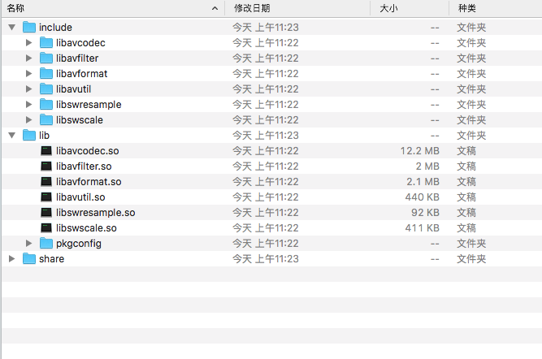
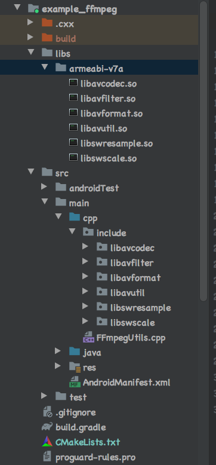

# FFmpeg交叉编译Android可用的动态so库

## 环境

* macOS High Sierra
* FFmpeg 4.0.5
* android-ndk-r16b

下载FFmpeg 4.0.5源代码，进入源码目录创建`build_android.sh`脚本

```shell
#!/bin/bash
ADDI_CFLAGS="-marm"
API=21
PLATFORM=arm-linux-androideabi
# 动态库的指令集
CPU=armv7-a
# 设置自己NDK的路径
NDK=/Users/chenpeng/Desktop/work_space/ndk/android-ndk-r16b 
SYSROOT=$NDK/platforms/android-$API/arch-arm/
ISYSROOT=$NDK/sysroot
ASM=$ISYSROOT/usr/include/$PLATFORM
TOOLCHAIN=$NDK/toolchains/$PLATFORM-4.9/prebuilt/darwin-x86_64
#指定一个输出目录，用来存放生成的头文件，动态库等
OUTPUT=/Users/chenpeng/Desktop/work_space/FFmpeg/out 
function build
{
./configure \
--prefix=$OUTPUT \
--enable-shared \
--disable-static \
--disable-doc \
--disable-ffmpeg \
--disable-ffplay \
--disable-ffprobe \
--disable-avdevice \
--disable-doc \
--disable-symver \
--cross-prefix=$TOOLCHAIN/bin/arm-linux-androideabi- \
--target-os=android \
--arch=arm \
--enable-cross-compile \
--sysroot=$SYSROOT \
--extra-cflags="-I$ASM -isysroot $ISYSROOT -Os -fpic -marm" \
--extra-ldflags="-marm" \
$ADDITIONAL_CONFIGURE_FLAG
  make clean
  make -j4
  make install
}

build
```

更多构建参数可以使用`./configure -h`参看

shell脚本语言不熟的可以查看我的[shell学习笔记](https://github.com/simplepeng/KeepLearning/tree/master/Shell)

执行`build_android.sh`脚本，等待脚本执行完成，执行过程可能会遇到缺少组件的问题，按需解决。

```shell
sh build_android.sh
```

生成文件目录如下：



## 创建一个新的Android Cmake项目

将动态库放入`libs/armeabi-v7a`文件夹，将头文件方法`cpp`目录



新增`FFmpegUtils.cpp`jni类，配置`build.gradle`，配置`CMakeLists.txt`

```c++
#include <jni.h>

//这里要注意，因为这是个c++文件，必须把头文件引用放到extern "C"中
//不然一直报undefined的错误，坑了很久，以前我都是写c
extern "C" {
#include <libavutil/avutil.h>

JNIEXPORT jstring JNICALL
Java_demo_simple_example_1ffmpeg_MainActivity_getVersion(JNIEnv *env, jclass clazz) {
    const char *version = av_version_info();
    return env->NewStringUTF(version);
}

}
```

```groovy
android {
    compileSdkVersion 29
    buildToolsVersion "30.0.0"

    defaultConfig {
        applicationId "demo.simple.example_ffmpeg"
        minSdkVersion 21
        targetSdkVersion 29
        versionCode 1
        versionName "1.0"

        testInstrumentationRunner "androidx.test.runner.AndroidJUnitRunner"

        //ndk so架构的选择
        externalNativeBuild {
            ndk {
                abiFilters 'armeabi-v7a'
            }
        }

        //so查找路径
        sourceSets {
            main {
                jniLibs.srcDirs = ['libs']
            }
        }
    }

    //cmake文件的查找路径
    externalNativeBuild {
        cmake {
            path file('CMakeLists.txt')
        }
    }
}
```

```cmake
# 设置构建本机库文件所需的 CMake的最小版本
cmake_minimum_required(VERSION 3.4.1)

# 添加自己写的 C/C++源文件
add_library(utils #so名称
        SHARED #动态库
        src/main/cpp/FFmpegUtils.cpp
        )

# 添加外部的库(可以是动态库或静态库)
set(LIBS_DIR ${CMAKE_SOURCE_DIR}/libs/${ANDROID_ABI})
add_library(
        avutil
        SHARED
        IMPORTED)
set_target_properties(
        avutil
        PROPERTIES IMPORTED_LOCATION
        ${LIBS_DIR}/libavutil.so)


#添加头文件的搜索路径
include_directories(src/main/cpp/include/)

#  依赖 NDK中自带的log库
find_library(log-lib log)

#  链接库
target_link_libraries(
        utils
        avutil
        ${log-lib})
```

## 加载动态库，获取FFmpeg的版本号

```java
public class MainActivity extends AppCompatActivity {

    private static final String TAG = "MainActivity";

    @Override
    protected void onCreate(Bundle savedInstanceState) {
        super.onCreate(savedInstanceState);
        setContentView(R.layout.activity_main);

        TextView tvVersion = findViewById(R.id.tvVersion);
        String version = String.format("ffmpeg version == %s", getVersion());
        tvVersion.setText(version);

        Log.d(TAG, version);
    }

    static {
        System.loadLibrary("utils");
        System.loadLibrary("avutil");
    }

    public static native String getVersion();
}
```

> 输出结果：
>
> demo.simple.example_ffmpeg D/MainActivity: ffmpeg version == 4.0.5

## 源码地址

https://github.com/simplepeng/AndroidExamples/tree/master/example_ffmpeg